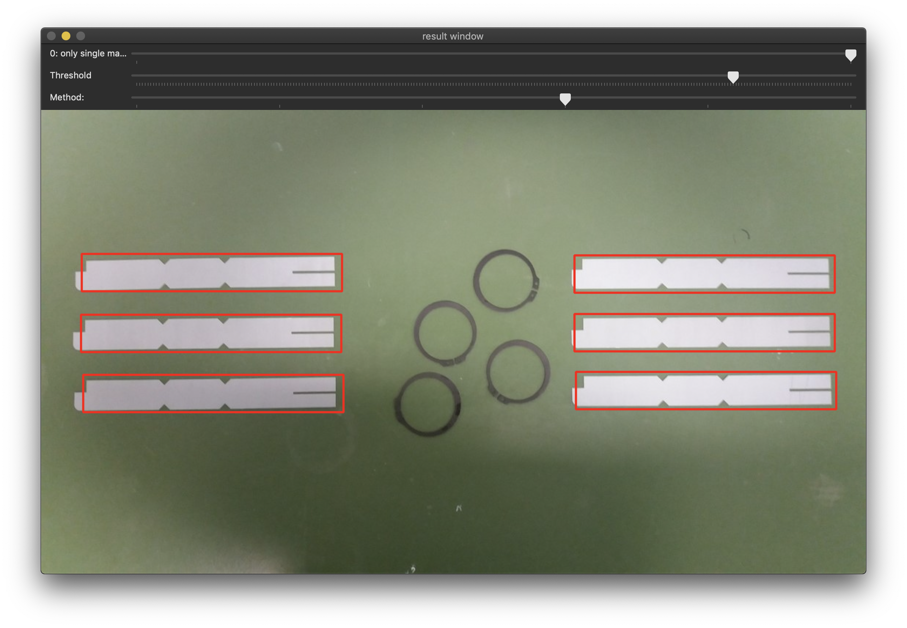

# Labo beeldinterpretatie 2018
## Sessie 0

### labo1-sessie0


| parameter | doel |
| -------- | -------- |
| -h | help |
| -ig | required! locatie van image in grijswaarden |
| -ic | required! locatie van image in kleur |

de applicatie gaat door alle stappen van de gevraagde opgave.
om naar het volgend scherm te gaan, gelieve op eender welke knop (behalve de powerknop) te drukken.

***

## Sessie 1

| Command | Action |
| ----- | ----- |
| (h)elp | Display help message |
| (t)hresholding| 1.1 Applies thresholding|
| (b)imodal | 1.1.2 Applies thresholding, OTSU Histogram equalisation and CHANE |
|(c)lean | 1.2 Use erosion and dilation to clean up picture, and find features (arms)|
| @image | (absolute) Path to image |


## usage:
  * in case of trouble: use absolute paths to images
  * to proceed to next window, press any button (except power)

  
### 1.1
```
./sessie1 -t /imageColor.jpg
```
### 1.1.2
```
./sessie1 -b /imageModal.jpg
```
### 1.2
```
./sessie1 -c /imageColorAdapted.jpg
```

***

## Sessie 2 

| Command | Action |
| ----- | ----- |
| (h)elp | Display help message |
| segBGR| Opdracht 1 : segmenteer in BGR |
| segHSV | Opracht 2 :  segmenteer in HSV |
| (c)lean | Opdracht 3 :  Use erosion and dilation to clean up picture, and find the traffic sign |
| sliders | Opdracht 4 : gebruik sliders om de threshold waarden aan te passen |
| (v)alues | druk de waarden van de sliders af in terminal |
| @image | (absolute) Path to image |

## usage:
  * in case of trouble: use absolute paths to images
  * to proceed to next window, press any button (except power)
  
## Note for mac users:
 DO NOT MOVE THE WINDOW WITH THE SLIDERS! IT WILL BREAK THE APPLICATION!!!
 
***

## Sessie 3

| Command | Action |
| ----- | ----- |
| (h)elp | Display help message |
| @template| Absolute path to template |
| @image | Absolute path to image |
| (f) indall| use this to use multiple template matching|

## usage: 
```
./sessie3 template.jpg recht.jpg -f
```

  * if you use -f, please slide the *amount\_of_matches* to 1
  * I found that *TM\_CCORR_NORMED* With a threshold of around 223 to work best 
 
## working proof


	


***
  
  

